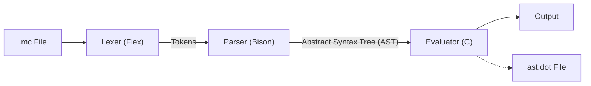

# 프로젝트 설명서: My Language Interpreter

**과목명:** 컴파일러(3166)  
**학번:** 202312347  
**이름:** 김지현  
**제출일:** 2025. 12. 09.

---

## 1. 개요 및 설계 의도 (Overview & Design Intent)

### 1.1 프로젝트 개요

본 프로젝트는 C, Flex, Bison을 활용하여 설계된 **Toy Language Interpreter**입니다. 정수형 변수 선언, 사칙연산, 제어 흐름(`if`, `while`), 그리고 입출력 기능을 지원합니다. 특히, 함수형 프로그래밍 스타일의 파이프 연산자(`|>`)를 도입하여 연산의 결과를 직관적으로 전달할 수 있도록 설계되었습니다.

### 1.2 설계 의도

-   **모듈화된 설계:** 어휘 분석(Lexer), 구문 분석(Parser), 실행기(Evaluator)를 명확히 분리하여 컴파일러의 프론트엔드와 백엔드 구조를 이해합니다.
-   **AST 시각화:** 파싱된 코드가 어떻게 트리 구조로 구성되는지 시각적으로 확인하기 위해 Graphviz 호환 `ast.dot` 생성 기능을 포함했습니다.
-   **확장성:** 파이프 연산자와 같은 새로운 문법 요소를 추가하며 Bison의 문법 정의 규칙을 실습합니다.

---

## 2. 전체 시스템 구조 (System Architecture)

본 인터프리터는 소스 코드를 입력받아 실행 결과를 출력하기까지 다음과 같은 파이프라인을 거칩니다.



1.  **Lexer (`scanner.l`)**: 입력된 문자열을 정규 표현식 규칙에 따라 토큰(Token)으로 분리합니다.
2.  **Parser (`parser.y`)**: 토큰의 배열을 문법 규칙(BNF)에 따라 분석하여 추상 구문 트리(AST)를 생성합니다.
3.  **AST Generator (`ast.c`)**: 구문 분석 과정에서 노드(Node)들을 연결하여 트리 자료구조를 만듭니다.
4.  **Evaluator (`ast.c`)**: 생성된 AST를 순회(Traversal)하며 로직을 수행하고 심볼 테이블을 관리합니다.

---

## 3\. 문법 정의 (Grammar Definition)

### 3.1 어휘 정의 (Lexical Rules)

`scanner.l`에 정의된 주요 토큰은 다음과 같습니다.

| 종류           | 토큰명                                                    | 패턴/키워드                           | 설명          |
| :------------- | :-------------------------------------------------------- | :------------------------------------ | :------------ |
| **Keywords**   | `TOK_LET`, `TOK_IF`, `TOK_WHILE`, `TOK_PRINT`, `TOK_SCAN` | `let`, `if`, `while`, `print`, `scan` | 예약어        |
| **Operators**  | `PLUS`, `MINUS`, `MULT`, `DIV`, `ASSIGN`, `TOK_PIPE`      | `+`, `-`, `*`, `/`, `=`, `\|>`        | 연산자        |
| **Comparison** | `EQ`, `LT`, `GT`                                          | `==`, `<`, `>`                        | 비교 연산자   |
| **Identifier** | `IDENTIFIER`                                              | `[a-zA-Z_][a-zA-Z0-9_]*`              | 변수명        |
| **Literal**    | `NUMBER`                                                  | `[0-9]+`                              | 정수형 리터럴 |

### 3.2 구문 규칙 (Syntax Rules)

`parser.y`에 정의된 문법을 EBNF 표기법으로 요약하면 다음과 같습니다.

```ebnf
program     ::= stmt_list

stmt_list   ::= stmt
              | stmt_list stmt

stmt        ::= "let" IDENTIFIER "=" expr ";"             /* 변수 선언 및 할당 */
              | IDENTIFIER "=" expr ";"                   /* 재할당 */
              | "print" "(" expr ")" ";"                  /* 출력 함수 */
              | expr "|>" "print" ";"                     /* 파이프 연산 출력 */
              | "if" "(" expr ")" "{" stmt_list "}"       /* 조건문 */
              | "while" "(" expr ")" "{" stmt_list "}"    /* 반복문 */

expr        ::= expr "+" expr | expr "-" expr
              | expr "*" expr | expr "/" expr
              | expr "==" expr | expr "<" expr | expr ">" expr
              | "(" expr ")"
              | "scan" "(" ")"                            /* 입력 함수 */
              | NUMBER | IDENTIFIER
```

**연산자 우선순위 (Precedence)**:

1.  `*`, `/` (가장 높음)
2.  `+`, `-`
3.  `==`, `<`, `>`
4.  `|>` (가장 낮음)

---

## 4\. 구현 기능 및 특징 (Features)

### 4.1 파이프 연산자 (`|>`)

함수형 언어(Ocaml, Elixir 등)에서 영감을 받아 구현된 기능입니다. 왼쪽 식의 계산 결과를 오른쪽 `print` 문의 인자로 전달합니다.

-   **예시:** `x + 5 |> print;` 는 `print(x + 5);`와 동일하게 동작합니다.

### 4.2 내장 업다운 게임 (Up & Down Game)

`eval()` 함수 내부에는 특정 숫자 출력 시 게임 메시지를 보여주는 이스터 에그(Easter Egg) 로직이 포함되어 있습니다. 이는 `game.mc` 파일 실행 시 활성화됩니다.

-   `print(900)`: 게임 시작 화면 출력
-   `print(1)`: "UP" 메시지 출력
-   `print(7777)`: "CORRECT" 메시지 출력

### 4.3 AST 시각화

프로그램 실행이 완료되면 전체 파싱 트리를 `ast.dot` 파일로 내보냅니다. 이를 Graphviz 도구를 통해 시각적인 이미지로 변환하여 컴파일 과정을 디버깅할 수 있습니다.

### 4.4 제어 흐름 및 변수 관리

-   **While 반복문:** 조건이 참일 동안 블록을 반복 실행하며, 팩토리얼 계산 등의 알고리즘 구현이 가능합니다.
-   **심볼 테이블:** 단순 연결 리스트 혹은 배열 형태(`sym_table`)로 구현되어 변수의 값을 저장하고 조회합니다.

---

## 5\. 제한 사항 및 개선 계획 (Limitations & Future Works)

1.  **자료형 제한:** 현재 `int` 타입만 지원하며, 실수형이나 문자열을 지원하지 않습니다. 추후 `union`을 활용하여 타입 시스템을 확장할 계획입니다.
2.  **스코프(Scope) 미지원:** 현재 모든 변수는 전역 변수처럼 처리됩니다. 블록(`{}`) 내부의 지역 변수 스코프 처리가 필요합니다.
3.  **함수 정의 불가:** 내장 함수(`print`, `scan`) 외에 사용자가 직접 함수를 정의하는 기능은 구현되어 있지 않습니다.
4.  **에러 핸들링:** 구문 에러 시 라인 번호만 출력하며, 구체적인 에러 원인이나 복구(Recovery) 기능은 미흡합니다.

---

## 6\. 결론 (Conclusion)

본 프로젝트를 통해 Lex와 Yacc(Flex/Bison)을 이용한 스캐너와 파서의 생성 과정을 익혔습니다. 또한 AST를 직접 설계하고 순회하는 인터프리터를 구현함으로써 프로그래밍 언어가 기계어 또는 실행 결과로 변환되는 내부 원리를 깊이 이해할 수 있었습니다.
